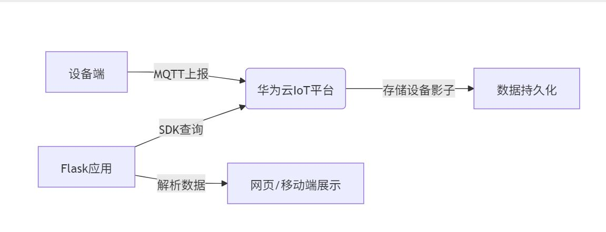
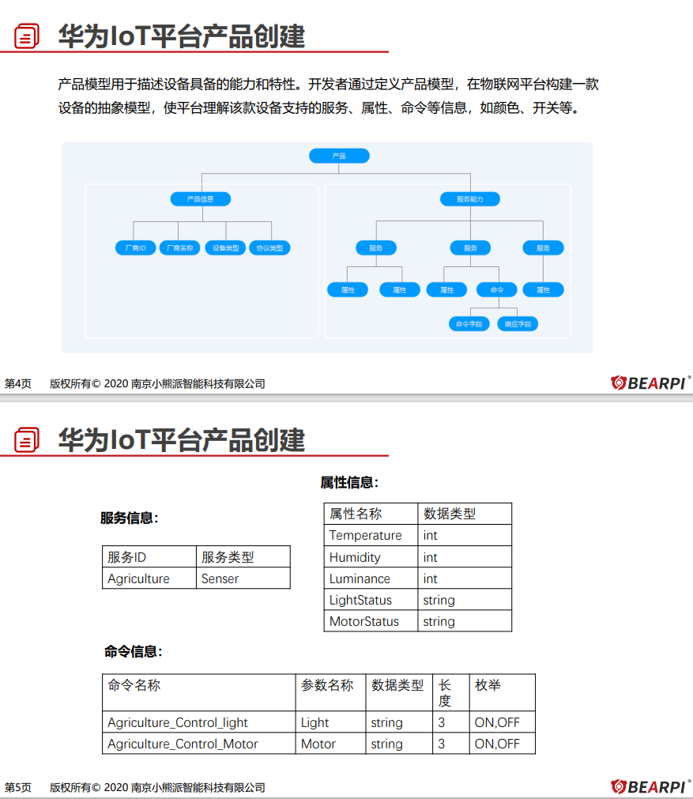

## 引言
这是我的第一篇博客，我记录一下在2025年6月学到的知识。
以 BearPi-HM_Nano 开发板与E53_IA1 传感器为硬件载体，使用MQTT协议与华为云IOT平台对接进行设备数据上传，通过Flask Web 服务实现与鸿蒙应用开发查看数据。

## 正文
一、设备端开发（小熊派BearPi-HM_Nano）​​
​​1. 环境搭建​​
​​虚拟机配置​​：
VMware安装Ubuntu，MobaXterm远程连接
代码拉取：
git clone https://gitee.com/bearpi/bearpi-hm_nano.git
​​工具链安装​​：
Python 3.8+：通过apt或源码编译安装
编译工具：gn、ninja、gcc_riscv32（环境变量配置需唯一）
依赖库：pip3 install kconfiglib pycryptodome six ecdsa  ，sudo apt-get install scons  
​​2. 设备端编程​​
​​样例工程整合​​：
​​本地测试​​：结合E53_IA1传感器驱动+TCP服务器，实现局域网数据交互（发送hello返回传感器数据）
​​云端集成​​：
烧录D12_iot_cloud_oc_agriculture样例，通过MQTT直连华为云，​关键配置​​​设备三元组​​ProductID、DeviceID、Secret写入代码
​​数据上报格式​​：按华为云物模型定义JSON结构：
{  
  "services": [{  
    "service_id": "Agriculture",  
    "properties": {  
      "temperature": 25.6,  
      "humidity": 60,  
      "lightIntensity": 1200  
    }  
  }]  
}  
​​二、华为云IoT​​平台接入
​​1. 平台配置步骤​​
​​创建产品​​：
定义物模型属性（温度、湿度、光照强度）与命令（如控制灯光开关）
​​注册设备​​：
记录设备ID、密钥，生成MQTT连接参数（ClientID/Username/Password）
​​设备影子​​：
通过ShowDeviceShadow API获取设备最新状态
2、ppt

​​三、应用侧开发（ Flask Web 服务实现 + 鸿蒙应用开发deveco）​​
​​1.  Flask Web 服务实现
​代码核心（httptest.py）：
python
from flask import Flask
from huaweicloudsdkcore.auth.credentials import BasicCredentials
from huaweicloudsdkiotda.v5 import IoTDAClient, ShowDeviceShadowRequest

app = Flask(__name__)

@app.route('/')
def index():
    ak, sk = "访问密钥", "秘密密钥"
    endpoint = "应用侧接入地址"  # 如 fc6e2a9b7c.st1.iotda-app.cn-north-4.myhuaweicloud.com:443
    projectId, device_id = "项目ID", "设备ID"
    
    # 初始化客户端
    credentials = BasicCredentials(ak, sk, projectId)
    client = IoTDAClient.new_builder()\
        .with_credentials(credentials)\
        .with_region(coreRegion(id="cn-north-4", endpoint=endpoint))\
        .build()
    
    # 获取设备影子数据（含温湿度、光照）
    request = ShowDeviceShadowRequest(device_id=device_id)
    response = client.show_device_shadow(request)
    return str(response)  # 页面展示数据

if __name__ == "__main__":
    app.run(port=10086, host="0.0.0.0", debug=True)

运行与验证：
安装 Flask：pip install Flask，启动服务：python3 httptest.py。
访问网址（如http://192.168.15.131:10086），页面显示云端同步的传感器数据。
2.鸿蒙应用开发deveco
使用 Deveco Studio 进行鸿蒙应用开发，实现将华为云 IOT 平台的环境数据温湿度、光照强度可视化展示。
核心工作包括：
应用界面设计与布局
网络权限配置与数据请求
云端数据解析与界面渲染
定时刷新与手动刷新功能实现

网络权限配置：
在.json中添加网络权限，允许应用访问 Web 服务获取云端数据：
json
"requestPermissions": [
  {
    "name": "ohos.permission.INTERNET",
    "usedScene": {
      "when": "always"
    }
  }
]

网络数据获取与解析：
typescript
fetchData() {
  this.httpClient?.request('http://192.168.15.131:2020/', {
    method: http.RequestMethod.GET
  }).then(resp => {
    let result: Object = resp.result
    console.log('网络数据：' + JSON.stringify(result))
    try {
      // 解析华为云设备影子数据
      let data:string =JSON.parse(result.toString())['shadow'][0]['reported']['properties']
      this.temperature = data['Temperature'] + '°C'
      this.Humidity = data['Humidity'] + '%'
      this.Luminance = data['Luminance'] + 'lx'
      this.lastUpdateTime = new Date().toLocaleTimeString()
    } catch (e) {
      console.error('数据解析错误: ' + e)
    }
  }).catch((err: Error) => {
    console.log('网络数据获取失败: ' + JSON.stringify(err))
  })
}
HTTP 请求，访问http://192.168.15.131:2020/获取云端数据；
数据解析，从设备影子（shadow）中提取Temperature、Humidity、Luminance字段。

UI 界面布局：
声明式 UI，通过build函数描述 UI 结构，数据驱动界面自动更新。
布局结构，采用 Column（垂直布局）嵌套 Row（水平布局），构建卡片式数据展示界面；
组件特性，Text显示文本内容，支持字体大小、颜色、粗细配置；Button，手动刷新按钮，绑定fetchData事件。

数据流转链路：
鸿蒙应用 → HTTP GET → Flask Web服务 → 华为云IOT平台 → 设备影子数据 → 界面渲染

## 结论
生活就像一场旅行，有欢笑也有泪水。我们要学会在困难中成长，在平凡中发现美好。希望我的这些感悟能给大家带来一些启发。感谢大家的阅读！

本地修改内容
